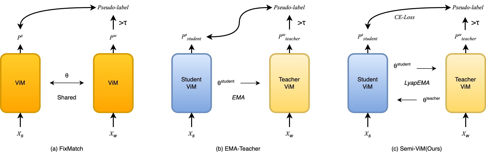

<!-- ===================================================== -->
<!--  🌌 Semi-ViM: ICCV 2025 | Advanced Gradient README   -->
<!-- ===================================================== -->

<p align="center">
  
</p>

<p align="center">
  
  
  
  
</p>

<p align="center">
  
</p>

---

# 🌌 Semi-ViM: Bidirectional State Space Model for Mitigating Label Imbalance in Semi-Supervised Learning

> Official PyTorch implementation of **Semi-ViM**, accepted to **ICCV 2025**.  
> Semi-ViM unifies **Vision Mamba** (ViM) with Lyapunov-stable optimization and hidden-state-level Mixup,  
> achieving unprecedented robustness under **label imbalance** in semi-supervised learning.

---

## 🧠 Overview

**Semi-ViM** extends **Vision Mamba (ViM)** — a **bidirectional State Space Model (SSM)** — into the semi-supervised regime.  
It introduces two novel algorithmic components:

### ⚖️ LyapEMA — Lyapunov-Guided Stability Update
> A stability-aware variant of EMA that ensures monotonic convergence between student and teacher models.

\[
V_t = \frac{1}{2}\|\theta_s - \theta_t\|^2,\quad \dot{V}_t < 0
\]

LyapEMA dynamically adjusts the EMA decay factor based on Lyapunov energy decrease, preventing collapse.

### 🔄 SSMixup — Hidden-State-Level Mixup
> Mixup applied not to inputs, but to the **bidirectional hidden dynamics** inside ViM.

\[
h_{mix} = \psi h_{fwd} + (1 - \psi) h_{bwd},\quad 
y_t = \mathrm{SiLU}(z)\odot y_{fwd} + \mathrm{SiLU}(z)\odot y_{bwd} + \nu Ch_{mix}
\]

This hybrid fusion enhances generalization and reduces pseudo-label bias.

---

## 🌗 Dual-Mode Visualization

<picture>
  <source media="(prefers-color-scheme: dark)" srcset="Semi-ViM.jpg">
  <source media="(prefers-color-scheme: light)" srcset="Semi-ViM.jpg">
  
</picture>

---

## 🚀 Key Highlights

- 🧩 **Bidirectional State Space backbone (ViM)**
- ⚖️ **Lyapunov-Stable Teacher Updates (LyapEMA)**
- 🔄 **Hidden-State Mixup (SSMixup)**
- 🔥 **Autoregressive Mamba (ARM) Pretraining**
- 📊 **+6.2% Top-5 accuracy** over Semi-ViT-Huge on ImageNet-LT  
- 🧮 **4× fewer parameters** and **linear complexity**

---

## 📊 Benchmark Results

| Model | Backbone | Params | Dataset | 1% Labels | 10% Labels |
|:------|:----------|:-------|:--------|:-----------|:-----------|
| FixMatch | ResNet-50 | 25M | ImageNet-LT | – | 57.7% |
| Semi-ViT-Huge | ViT-Huge | 632M | ImageNet-LT | 58.9% | 73.5% |
| **Semi-ViM-Base (Ours)** | ViM-Base | 146M | ImageNet-LT | **66.3%** | **77.4%** |

> 🏆 *Semi-ViM outperforms Semi-ViT-Huge by 6.2% with 10× fewer parameters.*

---


## ⚙️ Installation

```bash
git clone https://github.com/HoHongYeung/ICCV25-Semi-ViM.git
cd ICCV25-Semi-ViM
conda create -n semivim python=3.10 -y
conda activate semivim
pip install -r requirements.txt

---


## 🧮 Citation

If you find this work useful, please cite:

@article{he2025semi,
  title={Semi-ViM: bidirectional state space model for mitigating label imbalance in semi-supervised learning},
  author={He, Hongyang and Xie, Hongyang and You, Haochen and Sanchez Silva, Victor},
  year={2025},
  publisher={IEEE}
}


## 🤝 Acknowledgements

This research is a collaboration between
University of Warwick, Columbia University, and Tricks-of-Semi-supervisedDeepLeanring-Pytorch .
We thank the developers of FixMatch, Semi-ViT, and Mamba2D for inspiring baselines.
